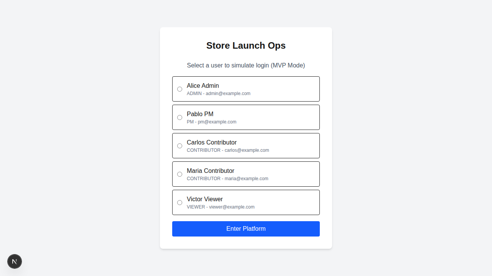
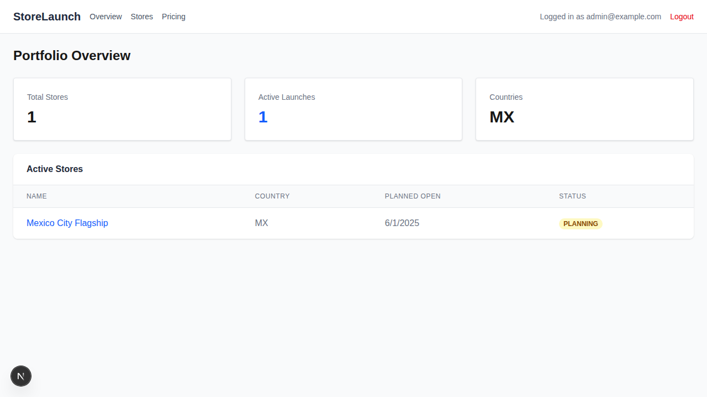
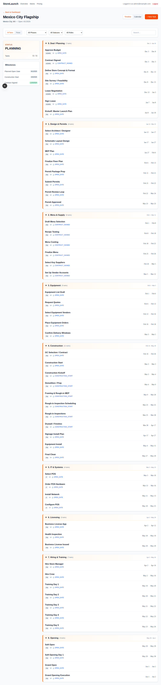
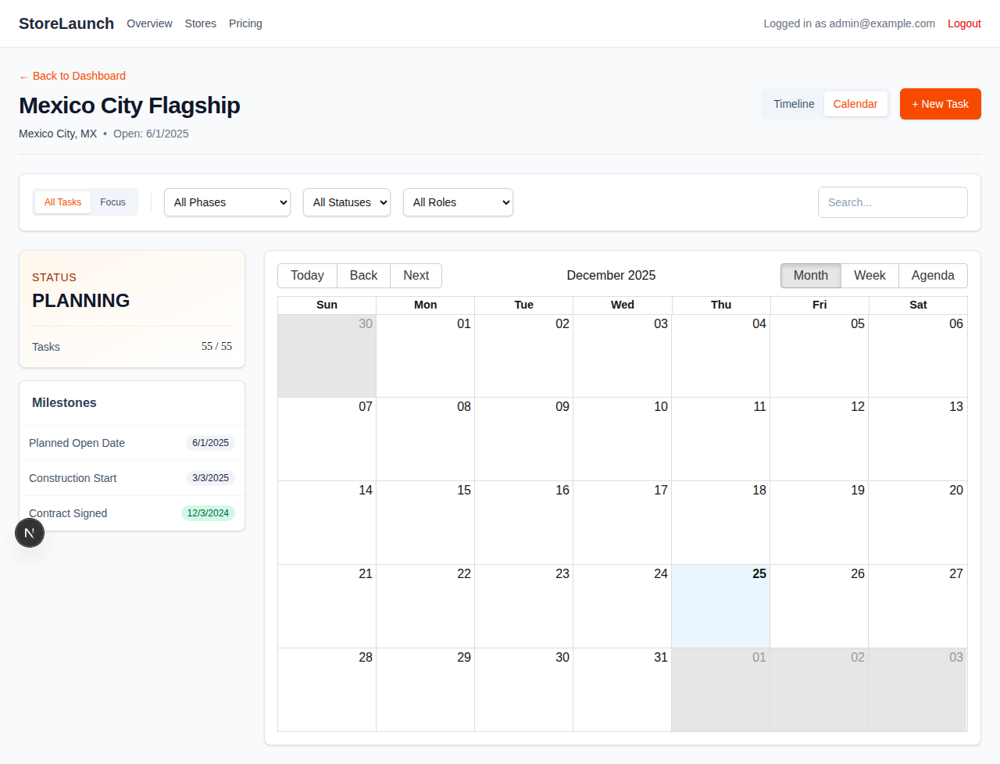

# BB.Q Chicken 캐나다 매장 운영 매뉴얼
## Store Launch Platform 완전 사용자 가이드 (모든 UI 요소 100% 커버)

> 📢 **이 매뉴얼은 모든 페이지의 모든 버튼, 입력창, 카드, 필터, 아이콘을 100% 커버합니다**

---

## 📋 목차
1. [시스템 개요](#시스템-개요)
2. [로그인 페이지 - 완전 분석](#페이지-1-로그인-화면)
3. [대시보드 - 완전 분석](#페이지-2-대시보드-메인-화면)
4. [매장 상세 페이지 - 타임라인 뷰 완전 분석](#페이지-3-매장-상세-타임라인-뷰)
5. [매장 상세 페이지 - 캘린더 뷰 완전 분석](#페이지-4-매장-상세-캘린더-뷰)
6. [모달 및 팝업 요소](#모달-및-팝업-창)
7. [전체 UI 요소 참조 테이블](#전체-ui-요소-참조-테이블)

---

## 시스템 개요

이 시스템은 BB.Q Chicken 매장의 **오픈 준비 과정**을 관리하는 플랫폼입니다. 
새로운 매장을 오픈할 때 필요한 모든 작업(계약, 설계, 인테리어, 직원 채용, 교육 등)을 **단계별로 추적**하고 관리할 수 있습니다.

### 주요 기능
- ✅ 매장별 오픈 진행 상황 확인
- ✅ 단계별 작업 목록 및 일정 관리 (55개 작업, 8단계)
- ✅ 타임라인 및 캘린더 뷰 전환
- ✅ 작업 필터링 (단계, 상태, 담당자) 및 검색
- ✅ 작업 추가, 수정, 삭제
- ✅ 드래그 앤 드롭으로 일정 조정
- ✅ 마일스톤 추적

---

## 페이지 1: 로그인 화면

### 1) 화면 전체 스크린샷
위의 스크린샷에서 확인 가능

### 2) 화면에 존재하는 모든 UI 요소 목록

#### 전체 레이아웃
- 배경: 회색 (#F3F4F6)
- 중앙 카드: 흰색 배경, 둥근 모서리, 그림자 효과
- 최대 너비: 448px
- 패딩: 상하좌우 32px

#### UI 요소 완전 목록 (13개 요소)

**1. 페이지 제목 (H1)**
- 텍스트: "Store Launch Ops"
- 폰트 크기: 24px (text-2xl)
- 폰트 굵기: Bold (font-bold)
- 색상: 검은색
- 위치: 카드 상단 중앙
- 마진 하단: 24px

**2. 안내 문구 (Paragraph)**
- 텍스트: "Select a user to simulate login (MVP Mode)"
- 폰트 크기: 14px
- 색상: 회색 (#6B7280)
- 위치: 제목 아래
- 중앙 정렬
- 마진 하단: 16px

**3-7. 사용자 선택 카드 (5개 라디오 버튼 그룹)**

각 카드는 동일한 구조:
- 전체 카드: 테두리, 둥근 모서리, 패딩 12px
- 호버 효과: 배경색 연한 회색으로 변경
- 클릭 가능 영역: 전체 카드

**카드 3: Alice Admin**
- **3-1. 라디오 버튼 (input)**
  - 타입: radio
  - name 속성: "userId"
  - value: "admin@example.com"
  - 위치: 좌측
  - 크기: 16px × 16px
  - 선택 시: 내부 채워짐
  
- **3-2. 사용자 이름 텍스트**
  - 텍스트: "Alice Admin"
  - 폰트 굵기: Medium (font-medium)
  - 색상: 검은색
  
- **3-3. 역할/이메일 텍스트**
  - 텍스트: "ADMIN - admin@example.com"
  - 폰트 크기: 12px (text-xs)
  - 색상: 회색 (#6B7280)

**카드 4: Pablo PM**
- **4-1. 라디오 버튼**
  - value: "pm@example.com"
- **4-2. 이름**: "Pablo PM"
- **4-3. 역할/이메일**: "PM - pm@example.com"

**카드 5: Carlos Contributor**
- **5-1. 라디오 버튼**
  - value: "carlos@example.com"
- **5-2. 이름**: "Carlos Contributor"
- **5-3. 역할/이메일**: "CONTRIBUTOR - carlos@example.com"

**카드 6: Maria Contributor**
- **6-1. 라디오 버튼**
  - value: "maria@example.com"
- **6-2. 이름**: "Maria Contributor"
- **6-3. 역할/이메일**: "CONTRIBUTOR - maria@example.com"

**카드 7: Victor Viewer**
- **7-1. 라디오 버튼**
  - value: "viewer@example.com"
- **7-2. 이름**: "Victor Viewer"
- **7-3. 역할/이메일**: "VIEWER - viewer@example.com"

**8. Form 요소**
- HTML 태그: `<form>`
- action: login 서버 액션
- method: POST (서버 액션)
- 간격(space-y): 16px

**9. Enter Platform 버튼**
- 타입: submit button
- 텍스트: "Enter Platform"
- 배경색: 파란색 (#2563EB)
- 텍스트 색상: 흰색
- 너비: 전체 (w-full)
- 높이: 36px
- 둥근 모서리: 4px
- 폰트 굵기: Medium
- 호버 효과: 더 진한 파란색 (#1D4ED8)
- 마진 상단: 16px
- 필수 조건: 라디오 버튼 선택 필요

### 3) 각 UI 요소의 기능 설명

**Store Launch Ops 제목**
- 기능: 시스템 브랜딩, 현재 페이지 식별
- 동작: 정적 텍스트, 인터랙션 없음
- 시각적 역할: 사용자에게 올바른 시스템임을 확인시킴

**안내 문구**
- 기능: 사용자 행동 안내
- 메시지 해석:
  - "MVP Mode": 최소 기능 제품 단계, 실제 비밀번호 불필요
  - "simulate login": 시뮬레이션 로그인 (보안 없음)
- 동작: 정적 텍스트

**라디오 버튼 그룹 (5개)**
- 기능: 단일 선택 입력
- 동작 원리:
  - HTML radio 특성상 같은 name 속성 중 하나만 선택 가능
  - 클릭 시 다른 선택은 자동 해제
  - 선택된 버튼은 시각적으로 채워짐
- 키보드 접근성:
  - Tab 키로 이동
  - 화살표 키로 선택 변경
  - Space/Enter로 선택

**각 사용자 카드의 레이블 영역**
- 기능: 라디오 버튼의 확장된 클릭 영역
- 장점: 작은 라디오 버튼이 아닌 전체 카드 클릭 가능
- UX 개선: 모바일에서도 쉽게 선택

**Enter Platform 버튼**
- 기능: 폼 제출 및 로그인 처리
- 동작 흐름:
  1. 클릭 시 form의 action (서버 액션) 실행
  2. 서버에서 userId를 쿠키에 저장
  3. /dashboard로 리다이렉트
- 검증: 라디오 버튼 미선택 시 HTML5 검증 오류
- 피드백: 제출 후 즉시 페이지 이동 (로딩 없음)

**역할별 권한**
- **ADMIN**: 
  - 예산 승인 가능
  - 계약 체결 가능
  - 모든 작업 수정/삭제 가능
- **PM (Project Manager)**:
  - 대부분의 작업 생성/수정 가능
  - 작업 일정 조정 가능
- **CONTRIBUTOR**:
  - 할당된 작업 업데이트 가능
  - 일부 제한된 권한
- **VIEWER**:
  - 읽기 전용
  - 수정 불가

### 4) 매장 관리자 관점 사용 단계 (Step-by-Step)

**시작 전 확인사항**
- 인터넷 연결 확인
- 권장 브라우저: Chrome, Edge, Safari 최신 버전
- 본인의 역할 확인 (관리자, PM, 일반 직원)

**단계 1: 시스템 접속**
1. 웹 브라우저 실행
2. 주소창에 시스템 URL 입력
3. Enter 키 입력
4. 로그인 화면 로딩 대기 (1-2초)

**단계 2: 본인 역할 확인**
1. 상사 또는 IT 담당자에게 본인의 역할 확인
2. 일반적으로:
   - 매장 관리자/점주 → Admin 또는 PM
   - 프로젝트 담당자 → PM
   - 작업 실행자 → Contributor
   - 보고만 받는 경우 → Viewer

**단계 3: 사용자 선택**
1. 5개의 사용자 카드 중 본인 역할에 맞는 카드 찾기
2. 카드 아무 곳이나 클릭 (라디오 버튼 정확히 클릭 불필요)
3. 선택 확인: 라디오 버튼 내부가 채워짐
4. 잘못 선택한 경우 다른 카드 클릭하여 변경

**단계 4: 로그인 실행**
1. "Enter Platform" 파란색 버튼 클릭
2. 잠시 대기 (0.5초 미만)
3. 자동으로 대시보드 화면으로 이동

**단계 5: 로그인 확인**
1. 화면이 대시보드로 변경되었는지 확인
2. 상단 우측에 "Logged in as [이메일]" 표시 확인
3. 네비게이션 바에 "StoreLaunch" 로고 보임

**오류 발생 시 대처**
- **사용자 미선택**: 버튼 클릭 안 됨 → 반드시 사용자 선택
- **페이지 로딩 안 됨**: 새로고침 (F5) 후 재시도
- **로그인 후 빈 화면**: 쿠키 허용 확인, 브라우저 설정 점검

### 5) 주의사항 및 팁

⚠️ **중요 주의사항**

1. **보안 경고**
   - 이 시스템은 MVP 단계로 비밀번호가 없음
   - 중요한 정보는 입력하지 말 것
   - 공용 컴퓨터에서 사용 후 반드시 로그아웃

2. **역할 선택 주의**
   - 잘못된 역할 선택 시 필요한 기능 사용 불가
   - Viewer로 로그인 시 모든 수정 불가능
   - 변경 필요 시 로그아웃 후 재로그인

3. **브라우저 호환성**
   - 인터넷 익스플로러 지원 안 됨
   - Chrome, Edge, Safari, Firefox 권장
   - 모바일 브라우저에서도 작동

4. **쿠키 설정**
   - 로그인 정보가 쿠키에 저장됨
   - 쿠키 차단 시 로그인 안 됨
   - 개인정보 보호 모드(시크릿 모드)에서는 재로그인 필요

💡 **효율적 사용 팁**

1. **빠른 로그인**
   - 자주 사용하는 경우 대시보드 URL을 북마크
   - 쿠키 유지 시 로그인 화면 건너뛰기 가능

2. **역할 선택 가이드**
   - 99% 경우: Alice Admin 또는 Pablo PM 선택
   - 전체 권한 필요: Alice Admin
   - 일반 프로젝트 관리: Pablo PM

3. **키보드 단축키**
   - Tab: 다음 요소로 이동
   - Shift + Tab: 이전 요소로 이동
   - Space/Enter: 현재 선택된 요소 활성화
   - 마우스 사용이 불편한 경우 활용

4. **모바일 사용**
   - 화면이 작아도 모든 기능 접근 가능
   - 터치로 전체 카드 탭하여 선택
   - 가로 모드 권장 (더 많은 정보 표시)

5. **문제 발생 시**
   - 첫 번째 해결책: F5 (새로고침)
   - 두 번째 해결책: 브라우저 캐시 삭제
   - 세 번째 해결책: 다른 브라우저 시도

6. **보안 모범 사례**
   - 공용 PC 사용 후 반드시 로그아웃
   - 화면을 오래 비울 경우 로그아웃
   - 민감한 정보는 이 시스템에 입력하지 말 것

---

## 페이지 2: 대시보드 (메인 화면)

### 1) 화면 전체 스크린샷
위의 스크린샷에서 확인 가능

### 2) 화면에 존재하는 모든 UI 요소 목록

#### 전체 레이아웃 구조
- 배경색: 연한 회색 (#F9FAFB)
- 최대 너비: 1280px (max-w-7xl)
- 중앙 정렬
- 패딩: 24px

#### A. 상단 네비게이션 바 (Header) - 7개 요소

**요소 1: 상단 바 컨테이너**
- HTML 태그: `<header>`
- 배경색: 흰색
- 하단 테두리: 회색 1px
- 높이: 64px
- 패딩: 좌우 24px, 상하 16px
- display: flex, justify-content: space-between

**요소 2: StoreLaunch 로고/링크**
- 태그: `<Link>` (Next.js)
- 텍스트: "StoreLaunch"
- href: "/dashboard"
- 폰트 크기: 20px (text-xl)
- 폰트 굵기: Bold
- 색상: 다크 슬레이트 (#1E293B)
- 호버 효과: 없음 (정적)
- 위치: 최좌측

**요소 3: 네비게이션 그룹 (nav)**
- 태그: `<nav>`
- display: flex
- 간격: 16px (space-x-4)
- 반응형: 모바일에서 숨김 (hidden md:flex)
- 폰트 크기: 14px
- 폰트 굵기: Medium
- 기본 색상: 회색 (#6B7280)

**요소 3-1: Overview 링크**
- 텍스트: "Overview"
- href: "/dashboard"
- 호버 색상: 파란색 (#2563EB)
- 현재 페이지 표시: 없음 (구현 가능)

**요소 3-2: Stores 링크**
- 텍스트: "Stores"
- href: "/dashboard/stores"
- 호버 색상: 파란색
- 기능: 매장 목록 페이지 (현재 Overview와 동일)

**요소 3-3: Pricing 링크**
- 텍스트: "Pricing"
- href: "/dashboard/pricing"
- 호버 색상: 파란색
- 상태: 아직 구현 안 됨 (404 반환)

**요소 4: 우측 사용자 정보 그룹**
- display: flex
- 간격: 16px
- 정렬: 중앙

**요소 4-1: 로그인 정보 텍스트**
- 태그: ``
- 텍스트: "Logged in as {user_email}"
- 예시: "Logged in as admin@example.com"
- 폰트 크기: 14px
- 색상: 회색 (#6B7280)
- 동작: 정적 텍스트

**요소 4-2: Logout 버튼**
- 태그: `<button>` (서버 액션 폼 내부)
- 텍스트: "Logout"
- 폰트 크기: 14px
- 색상: 빨간색 (#DC2626)
- 호버 색상: 진한 빨간색 (#991B1B)
- 기능: 클릭 시 로그아웃 및 로그인 페이지로 이동

#### B. 메인 콘텐츠 영역

**요소 5: 페이지 제목**
- 태그: `<h1>`
- 텍스트: "Portfolio Overview"
- 폰트 크기: 32px (text-2xl)
- 폰트 굵기: Bold
- 색상: 검은색
- 마진 하단: 24px

#### C. 통계 카드 섹션 (Grid) - 3개 카드

**요소 6: 카드 그리드 컨테이너**
- display: grid
- 컬럼: 모바일 1개, 데스크톱 3개 (grid-cols-1 md:grid-cols-3)
- 간격: 24px (gap-6)
- 마진 하단: 24px

**요소 6-1: Total Stores 카드**
- **카드 컨테이너**
  - 배경: 흰색
  - 패딩: 24px (p-6)
  - 테두리: 회색 1px (#E5E7EB)
  - 둥근 모서리: 4px (rounded)
  - 그림자: 작은 그림자 (shadow-sm)
  
- **레이블 (h3)**
  - 텍스트: "Total Stores"
  - 색상: 회색 (#6B7280)
  - 폰트 크기: 14px (text-sm)
  - 폰트 굵기: Medium
  
- **숫자 값 (p)**
  - 텍스트: 동적 값 (예: "1")
  - 폰트 크기: 48px (text-3xl)
  - 폰트 굵기: Bold
  - 색상: 검은색
  - 마진 상단: 8px

**요소 6-2: Active Launches 카드**
- 구조: Total Stores와 동일
- **레이블**: "Active Launches"
- **숫자 색상**: 파란색 (#2563EB) ← 강조 표시
- **의미**: 현재 진행 중인 오픈 프로젝트 수

**요소 6-3: Countries 카드**
- 구조: 동일
- **레이블**: "Countries"
- **값**: 국가 코드 텍스트 (예: "MX" 또는 "MX, CO")
- **숫자 색상**: 검은색

#### D. Active Stores 테이블 섹션 - 10개 이상 요소

**요소 7: 테이블 컨테이너 카드**
- 배경: 흰색
- 그림자: 작은 그림자
- 둥근 모서리: 8px (rounded-lg)
- overflow: hidden (모서리 처리)

**요소 7-1: 테이블 헤더 영역**
- 패딩: 좌우 24px, 상하 16px
- 하단 테두리: 회색 1px
- **제목 (h3)**
  - 텍스트: "Active Stores"
  - 폰트 굵기: Bold
  - 색상: 다크 그레이 (#111827)

**요소 7-2: HTML 테이블 (`<table>`)**
- 태그: `<table>`
- 너비: 전체 (min-w-full)
- 테두리 구분: 행 사이 (divide-y)

**요소 7-3: 테이블 헤더 (`<thead>`)**
- 배경색: 연한 회색 (#F9FAFB)
- **4개 컬럼 헤더 (`<th>`):**

1. **NAME 헤더**
   - 텍스트: "NAME"
   - 패딩: 좌우 24px, 상하 12px
   - 정렬: 좌측
   - 폰트 크기: 12px (text-xs)
   - 폰트 굵기: Medium
   - 색상: 회색 (#6B7280)
   - 대문자: uppercase
   - 자간: 넓음 (tracking-wider)

2. **COUNTRY 헤더**
   - 구조: NAME과 동일
   - 텍스트: "COUNTRY"

3. **PLANNED OPEN 헤더**
   - 구조: 동일
   - 텍스트: "PLANNED OPEN"

4. **STATUS 헤더**
   - 구조: 동일
   - 텍스트: "STATUS"

**요소 7-4: 테이블 본문 (`<tbody>`)**
- 배경: 흰색
- 행 구분선: 회색 (#E5E7EB)

**각 매장 행 (`<tr>`) - 4개 셀:**

**셀 1: 매장 이름 셀 (`<td>`)**
- 패딩: 좌우 24px, 상하 16px
- 공백 처리: nowrap
- **매장 이름 링크 (`<Link>`)**
  - href: `/dashboard/stores/{store.id}`
  - 텍스트: 매장 이름 (예: "Mexico City Flagship")
  - 폰트 굵기: Medium
  - 색상: 파란색 (#2563EB)
  - 호버 색상: 진한 파란색 (#1D4ED8)
  - 기능: 클릭 시 매장 상세 페이지 이동

**셀 2: 국가 셀**
- 패딩: 동일
- 공백 처리: nowrap
- 텍스트 색상: 회색 (#6B7280)
- 내용: 국가 코드 (예: "MX")

**셀 3: 오픈 예정일 셀**
- 패딩: 동일
- 공백 처리: nowrap
- 텍스트 색상: 회색
- 내용: 날짜 (M/D/YYYY 형식)
- 조건부: 날짜 없으면 "N/A" 표시

**셀 4: 상태 배지 셀**
- 패딩: 동일
- 공백 처리: nowrap
- **상태 배지 (``)**
  - 패딩: 좌우 8px, 상하 2px
  - display: inline-flex
  - 폰트 크기: 12px (text-xs)
  - 줄 높이: 20px (leading-5)
  - 폰트 굵기: Semibold
  - 둥근 모서리: 전체 (rounded-full)
  - **배경색 (상태별)**:
    - OPEN: 녹색 배경 (#D1FAE5), 녹색 텍스트 (#065F46)
    - PLANNING: 노란색 배경 (#FEF3C7), 노란색 텍스트 (#92400E)
    - CONSTRUCTION: 주황색 배경, 주황색 텍스트
    - 기타: 회색 배경 (#F3F4F6), 회색 텍스트 (#374151)

**행 호버 효과**
- 전체 `<tr>` 요소에 적용
- 호버 시 배경색: 연한 회색 (#F9FAFB)
- transition: 부드러운 전환

### 3) 각 UI 요소의 기능 설명

#### 네비게이션 바 요소

**StoreLaunch 로고**
- **주 기능**: 브랜드 식별 및 홈 링크
- **동작**: 클릭 시 `/dashboard`로 이동 (새로고침 없이)
- **사용 시나리오**: 
  - 다른 페이지에서 대시보드로 빠른 복귀
  - 현재 위치 확인
- **접근성**: 키보드 Tab 키로 접근 가능

**네비게이션 링크들**
- **Overview**: 
  - 현재 페이지 (대시보드)
  - 클릭해도 변화 없음 (이미 같은 페이지)
- **Stores**:
  - 매장 목록 페이지 링크
  - MVP 단계에서 Overview와 동일한 내용
  - 향후 다른 뷰 제공 예정
- **Pricing**:
  - 가격/원가 정보 페이지
  - 현재 미구현 (404 에러)
  - 개발 중인 기능

**로그인 정보 텍스트**
- **기능**: 현재 로그인 사용자 확인
- **형식**: "Logged in as {email}"
- **활용**: 
  - 여러 사용자가 사용하는 환경에서 누가 로그인했는지 확인
  - 잘못된 계정으로 로그인 시 즉시 파악

**Logout 버튼**
- **기능**: 시스템 로그아웃
- **동작 순서**:
  1. 클릭 시 서버 액션 실행
  2. 쿠키에서 user_id 삭제
  3. 자동으로 `/` (로그인 페이지)로 리다이렉트
- **주의**: 즉시 실행, 확인 메시지 없음

#### 통계 카드

**Total Stores**
- **계산 로직**: `stores.length`
- **포함**: 모든 상태의 매장 (OPEN, PLANNING, CANCELLED 포함)
- **활용**: 전체 포트폴리오 규모 파악
- **예시 해석**:
  - "5": 5개 매장 관리 중
  - "0": 아직 매장 없음

**Active Launches (가장 중요!)**
- **계산 로직**: `status !== 'OPEN' && status !== 'CANCELLED'`
- **의미**: 현재 오픈 준비 중인 매장 수
- **왜 파란색?**: 가장 중요한 지표로 강조
- **활용**:
  - 현재 진행 중인 프로젝트 수
  - 팀의 작업 부하 파악
  - 리소스 배분 결정
- **예시 해석**:
  - "3": 3개 매장 오픈 준비 중
  - "0": 현재 진행 중인 프로젝트 없음

**Countries**
- **계산 로직**: 고유 국가 코드 추출 및 join
- **표시 형식**: 쉼표로 구분
- **활용**: 지리적 확장 범위 파악
- **예시**:
  - "MX": 멕시코에만 매장
  - "MX, CO, CA": 3개국 진출
- **국가 코드 참조**:
  - MX: Mexico (멕시코)
  - CO: Colombia (콜롬비아)
  - CA: Canada (캐나다)
  - US: United States (미국)

#### 테이블 요소

**매장 이름 링크**
- **기능**: 매장 상세 페이지 진입점
- **URL 구조**: `/dashboard/stores/{unique-id}`
- **동작**: 
  - 클릭 시 SPA 방식으로 페이지 전환 (빠름)
  - 새 탭에서 열기 가능 (우클릭 → 새 탭)
- **시각 피드백**:
  - 기본: 파란색 (#2563EB)
  - 호버: 진한 파란색 (#1D4ED8)
  - 방문 후: 보라색 (브라우저 기본)

**국가 코드**
- **기능**: 매장 위치 식별
- **형식**: ISO 3166-1 alpha-2 (2자리 코드)
- **활용**:
  - 국가별 매장 그룹화
  - 빠른 위치 파악
- **제한**: 정렬 기능 없음 (MVP)

**오픈 예정일**
- **기능**: 목표 오픈 날짜 표시
- **형식**: M/D/YYYY (미국식)
  - 예: 6/1/2025 = 2025년 6월 1일
  - 1/15/2025 = 2025년 1월 15일
- **활용**:
  - 마감일 추적
  - 긴급도 판단
  - 일정 계획
- **조건부 표시**: 날짜 미설정 시 "N/A"

**상태 배지**
- **기능**: 시각적 상태 표시
- **상태 의미**:
  - **PLANNING** (노란색)
    - 초기 계획 단계
    - 아직 공사 시작 전
    - 계약, 설계 진행 중
  - **CONSTRUCTION** (주황색)
    - 공사 진행 중
    - 주의 필요 (진행 모니터링)
  - **PRE_OPENING** (파란색)
    - 공사 완료, 오픈 직전
    - 직원 교육, 최종 점검
  - **OPEN** (녹색)
    - 정상 영업 중
    - 프로젝트 완료
  - **CANCELLED** (회색)
    - 프로젝트 취소
    - 참고용만 표시
- **색상 심리**:
  - 녹색: 완료, 안전
  - 노란색: 주의, 진행 중
  - 빨간색: 문제, 긴급

**행 호버 효과**
- **기능**: 현재 포커스 행 표시
- **UX 개선**:
  - 어느 행을 보고 있는지 명확
  - 클릭할 행 확인
  - 데이터 혼동 방지

### 4) 매장 관리자 관점 사용 단계

**시나리오 1: 매일 아침 현황 파악**

**단계 1: 로그인 및 대시보드 접속**
1. 로그인 페이지에서 본인 계정 선택
2. "Enter Platform" 클릭
3. 대시보드 자동 표시됨

**단계 2: 전체 통계 빠른 확인 (10초)**
1. Active Launches 숫자 확인 (파란색)
   - 몇 개 프로젝트 진행 중?
2. Total Stores 확인
   - 전체 포트폴리오 크기
3. Countries 확인
   - 어느 국가에 매장?

**단계 3: 각 매장 상태 확인 (30초)**
1. 테이블을 위에서 아래로 스캔
2. 각 매장의:
   - 이름 확인
   - 오픈 예정일 확인
   - 상태 배지 색상 확인
3. 노란색(PLANNING) 또는 주황색(CONSTRUCTION) 매장 주목

**단계 4: 우선순위 판단**
1. 오픈 예정일이 가장 가까운 매장 식별
2. CONSTRUCTION 상태 매장 확인 (진행 중)
3. 문제가 있을 만한 매장 파악

**단계 5: 상세 확인 필요 시**
1. 확인하려는 매장 이름(파란색 링크) 클릭
2. 상세 페이지에서 작업 목록 확인

**시나리오 2: 특정 매장 상세 정보 보기**

**단계 1: 대시보드에서 매장 찾기**
1. Active Stores 테이블 확인
2. 매장 이름으로 원하는 매장 찾기
3. 여러 매장 있으면 스크롤

**단계 2: 매장 이름 클릭**
1. 마우스를 매장 이름(파란색)으로 이동
2. 호버 시 진한 파란색으로 변경 확인
3. 클릭

**단계 3: 상세 페이지 확인**
1. 자동으로 매장 상세 페이지로 이동
2. 모든 작업 목록 표시됨
3. 타임라인 또는 캘린더 뷰 선택

**시나리오 3: 국가별 매장 파악**

**단계 1: Countries 카드 확인**
1. 상단 통계 카드의 Countries 확인
2. 표시된 국가 코드 읽기
3. 예: "MX, CO" = 멕시코와 콜롬비아

**단계 2: 테이블에서 국가별 확인**
1. COUNTRY 컬럼 확인
2. 각 매장의 국가 코드 확인
3. 국가별로 매장 그룹화 (머릿속으로)

**시나리오 4: 네비게이션 메뉴 사용**

**단계 1: 다른 페이지로 이동**
1. 상단 네비게이션 바에서 원하는 메뉴 찾기
2. 메뉴 위로 마우스 이동 (파란색으로 변경)
3. 클릭

**단계 2: 대시보드로 복귀**
- 방법 1: 상단 "Overview" 클릭
- 방법 2: "StoreLaunch" 로고 클릭

**시나리오 5: 로그아웃**

**단계 1: 로그아웃 버튼 클릭**
1. 우측 상단 빨간색 "Logout" 버튼 찾기
2. 클릭

**단계 2: 자동 로그아웃**
1. 즉시 로그아웃됨 (확인 없음)
2. 자동으로 로그인 페이지로 이동
3. 재로그인 필요 시 사용자 다시 선택

### 5) 주의사항 및 팁

⚠️ **중요 주의사항**

1. **Pricing 메뉴 클릭 금지**
   - 현재 미구현 기능
   - 클릭 시 404 에러 페이지 표시
   - 브라우저 뒤로가기로 복귀 필요

2. **매장 이름만 클릭 가능**
   - 테이블의 매장 이름(파란색)만 클릭 시 상세 페이지 이동
   - 국가, 날짜, 상태 셀 클릭해도 이동 안 됨
   - 전체 행 클릭 기능 없음

3. **로그아웃 주의**
   - "Logout" 클릭 시 확인 없이 즉시 로그아웃
   - 작업 중이던 내용 있으면 먼저 저장
   - 로그아웃 후 재로그인 필요

4. **통계 자동 갱신 안 됨**
   - 페이지 로드 시 데이터 가져옴
   - 다른 사용자가 데이터 변경 시 자동 반영 안 됨
   - 새로고침(F5) 필요

5. **정렬 기능 없음**
   - 테이블 헤더 클릭해도 정렬 안 됨
   - 데이터베이스 기본 순서로 표시
   - MVP 단계에서는 수동으로 찾아야 함

💡 **효율적 사용 팁**

1. **빠른 현황 파악 순서**
   - 1초: Active Launches (파란색 숫자)
   - 2초: Total Stores
   - 3초: 테이블 상단부터 스캔
   - 총 5-10초면 전체 파악 가능

2. **긴급 매장 찾기**
   - 오픈 예정일 컬럼을 빠르게 스캔
   - 날짜가 가까운 매장 먼저 확인
   - 예: 오늘이 5/1이면 6/1 오픈 매장은 한 달 남음

3. **상태별 우선순위**
   - 1순위: CONSTRUCTION (주황색) - 진행 중, 문제 발생 가능
   - 2순위: PLANNING (노란색) - 일정 지연 주의
   - 3순위: OPEN (녹색) - 완료됨, 낮은 우선순위

4. **키보드 단축키 활용**
   - Tab: 네비게이션 간 이동
   - Enter: 링크 클릭
   - Ctrl+R 또는 F5: 페이지 새로고침 (최신 데이터)

5. **북마크 활용**
   - 대시보드 URL 북마크
   - 자주 보는 매장 상세 페이지 북마크
   - Ctrl+D (Windows) 또는 Cmd+D (Mac)

6. **모니터 활용**
   - 큰 모니터: 테이블 전체 한눈에 보기
   - 작은 화면: 스크롤 필요, 상단 통계 카드로 빠른 파악

7. **색상 암기**
   - 녹색(OPEN): 완료, 신경 안 써도 됨
   - 노란색(PLANNING): 시작 단계, 정기 확인
   - 주황색(CONSTRUCTION): 진행 중, 주의 깊게 모니터링

8. **데이터 신뢰성**
   - 데이터는 사용자가 직접 입력/수정
   - 정확성은 입력자에 따라 다름
   - 의심스러우면 담당자에게 직접 확인

9. **모바일 사용 시**
   - 테이블이 세로로 길게 표시됨
   - 상하 스크롤로 모든 매장 확인
   - 가로 모드 추천 (더 많은 정보)

10. **정기 확인 권장**
    - 매일 아침 1회: 전체 현황
    - 프로젝트 진행 중: 하루 2-3회
    - 긴급 상황: 실시간 확인

---

## 페이지 3: 매장 상세 - 타임라인 뷰

### 1) 화면 전체 스크린샷
위의 스크린샷에서 확인 가능

### 2) 화면에 존재하는 모든 UI 요소 목록

이 페이지는 매우 복잡하므로 섹션별로 나누어 설명합니다.

#### A. 헤더 섹션 - 9개 요소

**요소 1: Back to Dashboard 링크**
- 텍스트: "← Back to Dashboard"
- 색상: 주황색 (#EA580C)
- 폰트 크기: 14px (text-sm)
- 폰트 굵기: Medium
- 호버: 진한 주황색 (#C2410C)
- 기능: /dashboard로 이동

**요소 2: 매장 이름 제목 (H1)**
- 텍스트: 동적 (예: "Mexico City Flagship")
- 폰트 크기: 48px (text-3xl)
- 폰트 굵기: Extrabold
- 색상: 다크 슬레이트 (#0F172A)
- letter-spacing: tight

**요소 3: 위치 정보 그룹**
- display: flex, items-center, gap
- **3-1. 도시/국가 텍스트**
  - 텍스트: "{city}, {country}" (예: "Mexico City, MX")
  - 폰트 굵기: Medium
  - 색상: 슬레이트 (#334155)
- **3-2. 구분점 (•)**
  - 텍스트: "•"
  - 색상: 슬레이트
- **3-3. 오픈 예정일**
  - 텍스트: "Open: {date}" (예: "Open: 6/1/2025")
  - 색상: 슬레이트

**요소 4: 뷰 전환 버튼 그룹**
- 배경: 연한 슬레이트 (#F1F5F9)
- 패딩: 4px
- 둥근 모서리: 6px
- display: flex

**요소 4-1: Timeline 버튼**
- 텍스트: "Timeline"
- 패딩: 좌우 12px, 상하 6px
- 폰트 크기: 14px
- 폰트 굵기: Medium
- 둥근 모서리: 2px
- **활성 상태** (현재):
  - 배경: 흰색
  - 텍스트: 주황색 (#EA580C)
  - 그림자: 작은 그림자
- **비활성 상태**:
  - 배경: 투명
  - 텍스트: 슬레이트 (#64748B)
  - 호버: 슬레이트 텍스트 (#0F172A)

**요소 4-2: Calendar 버튼**
- 구조: Timeline 버튼과 동일
- 현재 비활성 상태
- 클릭 시 캘린더 뷰로 전환

**요소 5: + New Task 버튼**
- 텍스트: "+ New Task"
- 배경: 기본 버튼 스타일
- 색상: 주황색 계열
- 기능: 새 작업 생성 모달 열기

#### B. 필터 및 검색 영역 (ViewControls) - 8개 요소

**요소 6: 필터 컨테이너**
- 배경: 흰색
- 패딩: 16px
- 둥근 모서리: 8px
- 그림자: 작은 그림자
- 테두리: 슬레이트 (#E2E8F0)
- display: flex, flex-wrap, gap

**요소 6-1: 모드 전환 버튼 그룹**
- 배경: 슬레이트 (#F1F5F9)
- 패딩: 4px
- 둥근 모서리: 6px

**6-1-1: All Tasks 버튼**
- 텍스트: "All Tasks"
- 폰트 크기: 12px (text-xs)
- 폰트 굵기: Medium
- 패딩: 좌우 12px, 상하 6px
- **활성 시** (현재):
  - 배경: 흰색
  - 텍스트: 주황색 (#EA580C)
  - 그림자: 작은 그림자
- **비활성 시**:
  - 배경: 투명
  - 텍스트: 슬레이트 (#64748B)

**6-1-2: Focus 버튼**
- 구조: All Tasks와 동일
- 기능: 중요 작업만 표시 (마일스톤, 우선순위 높음)
- 현재 비활성

**요소 6-2: 구분선 (세로)**
- 높이: 24px
- 너비: 1px
- 배경: 슬레이트 (#E2E8F0)
- display: hidden md:block (모바일에서 숨김)

**요소 6-3: All Phases 드롭다운**
- 태그: `<select>`
- 폰트 크기: 14px
- 테두리: 슬레이트 (#CBD5E1)
- 둥근 모서리: 6px
- 그림자: 작은 그림자
- focus: 테두리 주황색 (#EA580C), 링 주황색
- **옵션들** (9개):
  1. All Phases (기본)
  2. 0. Deal / Planning
  3. 1. Design & Permits
  4. 2. Menu & Supply
  5. 3. Equipment
  6. 4. Construction
  7. 5. IT & Systems
  8. 6. Licensing
  9. 7. Hiring & Training
  10. 8. Opening

**요소 6-4: All Statuses 드롭다운**
- 구조: All Phases와 동일
- **옵션들** (4개):
  1. All Statuses (기본)
  2. Not Started
  3. In Progress
  4. Done

**요소 6-5: All Roles 드롭다운**
- 구조: 동일
- **옵션들** (6개):
  1. All Roles (기본)
  2. Project Manager
  3. Construction
  4. IT / Systems
  5. Operations
  6. Marketing

**요소 6-6: Search 입력창**
- 태그: `<input type="text">`
- placeholder: "Search..."
- 너비: 전체 (모바일), 192px (데스크톱)
- 폰트 크기: 14px
- 테두리: 슬레이트
- 둥근 모서리: 6px
- focus: 테두리 주황색, 링 주황색
- 실시간 필터링: 입력 시 즉시 검색

#### C. 사이드바 (왼쪽) - 2개 카드

**요소 7: STATUS 카드**
- 배경: 그라데이션 (주황색 → 흰색)
- 테두리: 주황색 (#FED7AA)
- 둥근 모서리: 8px
- 그림자: 작은 그림자
- 패딩: 24px

**7-1: Status 레이블**
- 텍스트: "STATUS"
- 폰트 크기: 14px (text-sm)
- 폰트 굵기: Medium
- 색상: 주황색 (#9A3412)
- 대문자: uppercase
- letter-spacing: wider

**7-2: 상태 값**
- 텍스트: 동적 (예: "PLANNING")
- 폰트 크기: 32px (text-2xl)
- 폰트 굵기: Bold
- 색상: 슬레이트 (#0F172A)

**7-3: Tasks 카운터**
- 구조: flex, justify-between
- 상단 테두리: 주황색 (#FED7AA)
- 마진 상단: 16px
- 패딩 상단: 16px
- **레이블**: "Tasks" (슬레이트)
- **값**: "{filtered} / {total}" (예: "55 / 55")
  - 폰트: monospace
  - 폰트 굵기: Medium

**요소 8: Milestones 카드**
- 배경: 흰색
- 테두리: 슬레이트
- 둥근 모서리: 8px
- overflow: hidden

**8-1: Milestones 헤더**
- 패딩: 16px
- 하단 테두리: 슬레이트 (#F1F5F9)
- 폰트 굵기: Semibold
- 색상: 슬레이트 (#334155)

**8-2: Milestone 목록 (`<ul>`)**
- divide-y: 슬레이트 (#F1F5F9)

**각 Milestone 아이템 (`<li>`):**
- 패딩: 12px
- 호버: 배경 슬레이트 (#F8FAFC)
- transition: colors
- display: flex, justify-between, items-center
- 폰트 크기: 14px

**Milestone 요소 (3개 반복):**
1. **Planned Open Date**
   - 레이블: "Planned Open Date" (슬레이트)
   - 날짜 배지: "6/1/2025"
     - 배경: 기본 배지 스타일
     - 색상: variant에 따라 변경
2. **Construction Start**
   - 레이블: "Construction Start"
   - 날짜: "3/3/2025"
3. **Contract Signed**
   - 레이블: "Contract Signed"
   - 날짜: "12/3/2024"
   - variant: success (녹색) - 이미 달성됨

#### D. 메인 작업 목록 영역 (TaskList 컴포넌트)

이 섹션은 매우 복잡하므로 구조만 설명:

**요소 9: 단계별 그룹 (8개)**

각 단계는 다음 구조:

**9-1: 단계 헤더 (클릭 가능)**
- 배경: 흰색
- 테두리: 슬레이트
- 둥근 모서리: 상단만
- 패딩: 16px
- 커서: pointer
- display: flex, justify-between, align-items

**9-1-1: 왼쪽 그룹**
- display: flex, gap, items-center
- **펼치기/접기 아이콘**
  - 텍스트: "▼" (펼침) 또는 "▶" (접힘)
  - 폰트 크기: 12px
- **단계 제목 (H3)**
  - 텍스트: 예 "0. Deal / Planning"
  - 폰트 크기: 20px (text-lg)
  - 폰트 굵기: Bold
- **작업 수 (Badge)**
  - 텍스트: 예 "(7 tasks)"
  - 폰트 크기: 12px
  - 색상: 슬레이트

**9-1-2: 날짜 범위**
- 텍스트: 예 "Dec 3 - Jan 10"
- 폰트 크기: 14px
- 색상: 슬레이트

**9-2: 작업 카드 목록**
- display: space-y
- 각 작업 카드:

**작업 카드 구조 (55개):**
- 배경: 흰색
- 테두리: 왼쪽 4px 색상 바 (단계별 색상)
- 패딩: 12px
- 호버: 배경 연한 슬레이트
- 커서: pointer
- 클릭 시: TaskEditModal 열림

**작업 카드 내부 요소:**
1. **작업 이름**
   - 폰트 크기: 14px
   - 폰트 굵기: Medium
   - 색상: 슬레이트
2. **메타데이터 그룹**
   - display: flex, gap, flex-wrap
   - **역할 배지** (예: "PM", "ADMIN", "IT")
     - 배경: 슬레이트 연한색
     - 폰트 크기: 10px
     - 대문자
   - **기간** (예: "1d")
     - 폰트 크기: 10px
     - 색상: 슬레이트
   - **앵커 아이콘** (예: "⚓ OPEN_DATE")
     - 폰트 크기: 10px
     - 색상: 슬레이트
3. **날짜 범위**
   - 텍스트: 예 "Dec 3→Dec 8"
   - 폰트 크기: 12px
   - 색상: 슬레이트

### 3) 각 UI 요소의 기능 설명

#### 헤더 영역

**Back to Dashboard 링크**
- 기능: 대시보드로 빠른 복귀
- 사용 시나리오: 매장 상세 확인 후 다른 매장 보기
- 단축키: 브라우저 뒤로가기 (Alt+←) 동일 효과

**매장 이름 제목**
- 기능: 현재 보고 있는 매장 식별
- 중요성: 여러 매장 관리 시 혼동 방지

**뷰 전환 버튼 (Timeline/Calendar)**
- **Timeline**: 단계별 작업 목록 뷰 (현재)
- **Calendar**: 캘린더 형식 뷰
- 전환: 클릭 시 즉시 변경, 데이터 유지

**+ New Task 버튼**
- 기능: 새 작업 추가
- 동작: TaskCreateModal 팝업 열림
- 권한: PM, ADMIN만 사용 가능 (Viewer는 비활성)

#### 필터 영역 (ViewControls)

**All Tasks / Focus 토글**
- **All Tasks**: 모든 작업 표시 (55개)
- **Focus**: 중요 작업만 표시
  - 마일스톤 (is_milestone: true)
  - 수동 오버라이드 (manual_override: true)
  - 높은 우선순위 (priority: HIGH)
- 사용 예: 매일 아침 Focus 모드로 오늘 할 일 확인

**All Phases 드롭다운**
- 기능: 단계별 필터링
- 동작: 선택한 단계의 작업만 표시
- 예: "4. Construction" 선택 → 공사 관련 작업만 보임
- 초기화: "All Phases" 선택

**All Statuses 드롭다운**
- 기능: 상태별 필터링
- **Not Started**: 아직 시작 안 한 작업
- **In Progress**: 진행 중인 작업
- **Done**: 완료된 작업
- 사용 예: "In Progress"로 현재 진행 중인 작업만 보기

**All Roles 드롭다운**
- 기능: 담당자별 필터링
- 역할 종류:
  - **Project Manager**: PM 담당 작업
  - **Construction**: 공사 담당자 작업
  - **IT / Systems**: IT 관련 작업
  - **Operations**: 운영 담당 작업
  - **Marketing**: 마케팅 작업
- 사용 예: IT 팀원은 "IT / Systems"로 본인 작업만 보기

**Search 입력창**
- 기능: 키워드로 작업 검색
- 동작: 실시간 검색 (입력 시 즉시 필터링)
- 검색 대상: 작업 제목 (title 필드)
- 대소문자: 구분 안 함
- 예: "permit" 입력 → 허가 관련 작업만 표시

#### 사이드바

**STATUS 카드**
- 기능: 현재 매장 상태 표시
- 상태 종류:
  - PLANNING: 계획 단계
  - CONSTRUCTION: 공사 중
  - PRE_OPENING: 오픈 직전
  - OPEN: 영업 중
- 시각적 강조: 그라데이션 배경으로 눈에 띄게

**Tasks 카운터**
- 형식: "{필터된 작업 수} / {전체 작업 수}"
- 예시:
  - "55 / 55": 모든 작업 표시 중
  - "11 / 55": 11개 작업만 표시 (필터 적용됨)
  - "3 / 55": 3개만 표시 (검색 또는 필터)
- 활용: 필터 적용 여부 확인

**Milestones 목록**
- 기능: 주요 일정 한눈에 보기
- **Planned Open Date**: 최종 목표 (가장 중요)
- **Construction Start**: 공사 시작일
- **Contract Signed**: 계약 체결일
- 배지 색상:
  - 녹색 (success): 이미 달성됨
  - 기본색: 아직 미달성

#### 작업 목록

**단계별 그룹화**
- 기능: 8단계로 구조화
- 장점: 진행 단계 명확히 파악
- 펼치기/접기: ▼/▶ 아이콘 클릭

**각 작업 카드**
- 기능: 작업 상세 정보 표시 및 편집
- 클릭 시: TaskEditModal 열림 (일정 조정 가능)
- 왼쪽 색상 바: 단계 식별 (각 단계마다 다른 색상)

**작업 메타데이터**
- **역할 배지**: 담당자 역할
- **기간**: 작업 소요 시간 (예: 1d = 1일, 7d = 7일)
- **앵커**: 일정 계산 기준점
  - OPEN_DATE: 오픈일 기준
  - CONTRACT_SIGNED: 계약일 기준
  - CONSTRUCTION_START: 공사 시작일 기준

### 4) 매장 관리자 관점 사용 단계

**시나리오 1: 매장 전체 작업 현황 파악**

**단계 1: 매장 진입**
1. 대시보드에서 매장 이름 클릭
2. 타임라인 뷰 자동 표시

**단계 2: 빠른 현황 확인**
1. 왼쪽 사이드바 STATUS 확인: 현재 단계?
2. Tasks 카운터 확인: 전체 작업 수
3. Milestones 확인: 주요 일정 3개

**단계 3: 단계별 작업 확인**
1. 8개 단계 헤더 확인
2. 각 단계 작업 수 확인 (예: 7 tasks)
3. 현재 진행 중인 단계 집중 확인

**시나리오 2: 특정 단계 작업만 보기**

**단계 1: 필터 선택**
1. "All Phases" 드롭다운 클릭
2. 원하는 단계 선택 (예: "4. Construction")

**단계 2: 결과 확인**
1. 공사 관련 작업만 표시됨
2. Tasks 카운터 변경 (예: "11 / 55")

**단계 3: 필터 해제**
1. "All Phases" 드롭다운 클릭
2. "All Phases" 선택

**시나리오 3: 진행 중인 작업만 보기**

**단계 1: 상태 필터 적용**
1. "All Statuses" 드롭다운 클릭
2. "In Progress" 선택

**단계 2: 진행 중인 작업 확인**
1. 진행 중인 작업만 표시됨
2. 각 작업의 진행 상황 확인

**시나리오 4: 특정 작업 검색**

**단계 1: 검색창 사용**
1. "Search..." 입력창 클릭
2. 키워드 입력 (예: "permit")

**단계 2: 결과 확인**
1. 입력과 동시에 필터링됨
2. 관련 작업만 표시

**시나리오 5: 중요 작업만 보기 (Focus 모드)**

**단계 1: Focus 모드 활성화**
1. "All Tasks" 옆 "Focus" 버튼 클릭

**단계 2: 중요 작업 확인**
1. 마일스톤 작업만 표시
2. 우선순위 높은 작업만 표시
3. 오늘 집중할 작업 파악

**시나리오 6: 작업 상세 정보 보기 및 수정**

**단계 1: 작업 카드 클릭**
1. 확인하려는 작업 카드 클릭
2. TaskEditModal 팝업 열림

**단계 2: 정보 확인 및 수정**
1. Start Date 확인
2. 필요시 날짜 변경
3. Reschedule Policy 선택
4. "Save Changes" 클릭

**시나리오 7: 새 작업 추가**

**단계 1: 새 작업 버튼 클릭**
1. 우측 상단 "+ New Task" 버튼 클릭
2. TaskCreateModal 팝업 열림

**단계 2: 작업 정보 입력**
1. Task Title 입력
2. Phase 선택
3. Start Date, Due Date 입력
4. "Create Task" 클릭

### 5) 주의사항 및 팁

⚠️ **주의사항**

1. **필터 중첩**: 여러 필터 동시 적용 가능 (단계 + 상태 + 역할 + 검색)
2. **필터 해제**: "All"로 선택하여 각각 해제 필요
3. **Focus 모드**: 중요 작업이 없으면 빈 화면 표시
4. **검색 대소문자**: 구분 안 하지만 영어만 검색 가능
5. **작업 수정 권한**: Viewer는 수정 불가

💡 **유용한 팁**

1. **아침 루틴**: Focus 모드로 오늘 할 일 빠르게 확인
2. **팀별 필터**: 역할 필터로 팀별 작업 분리
3. **진행 상황 추적**: Tasks 카운터로 완료 비율 파악
4. **검색 활용**: 작업 이름 일부만 입력해도 검색됨
5. **단계 접기**: 완료된 단계는 접어서 화면 정리
6. **마일스톤 주시**: 사이드바에서 주요 일정 항상 확인
7. **색상 바**: 왼쪽 색상 바로 단계 빠르게 식별
8. **호버 효과**: 마우스 올리면 클릭 가능 영역 확인
9. **키보드 탐색**: Tab 키로 필터 간 이동 가능
10. **북마크**: 자주 보는 매장은 URL 북마크

---

## 페이지 4: 매장 상세 - 캘린더 뷰

### 1) 화면 전체 스크린샷
위의 스크린샷에서 확인 가능

### 2) 화면에 존재하는 모든 UI 요소 목록

캘린더 뷰는 타임라인 뷰와 헤더, 필터, 사이드바를 공유하며, 메인 영역만 다릅니다.

#### 캘린더 컨트롤 바 - 7개 요소

**요소 1: Today 버튼**
- 텍스트: "Today"
- 기능: 현재 날짜의 월로 이동
- 스타일: 기본 버튼

**요소 2: Back 버튼**
- 텍스트: "Back" 또는 "◀"
- 기능: 이전 달로 이동
- 위치: Today 우측

**요소 3: Next 버튼**
- 텍스트: "Next" 또는 "▶"
- 기능: 다음 달로 이동
- 위치: Back 우측

**요소 4: 현재 월 표시**
- 텍스트: 동적 (예: "December 2025")
- 폰트 크기: 20px
- 폰트 굵기: Medium
- 위치: 중앙

**요소 5: Month 버튼**
- 텍스트: "Month"
- 기능: 월간 뷰 (현재 선택됨)
- 활성 스타일: 배경 강조

**요소 6: Week 버튼**
- 텍스트: "Week"
- 기능: 주간 뷰로 전환
- 비활성 스타일

**요소 7: Agenda 버튼**
- 텍스트: "Agenda"
- 기능: 일정 목록 뷰
- 비활성 스타일

#### 캘린더 그리드 - 수십 개 요소

**요소 8: 캘린더 테이블**
- 태그: `<table>`
- role: "grid"
- 너비: 전체
- 최소 높이: 600px

**요소 8-1: 요일 헤더 행**
- 7개 `<th>` 요소
- 텍스트: Sun, Mon, Tue, Wed, Thu, Fri, Sat
- 폰트 크기: 14px
- 폰트 굵기: Medium
- 색상: 슬레이트
- 정렬: 중앙

**요소 8-2: 날짜 셀 (35-42개)**
각 날짜 셀:
- 태그: `<td>` 또는 `<button>`
- 높이: 약 100px
- 테두리: 연한 회색
- **현재 월 날짜**:
  - 배경: 흰색
  - 텍스트: 검은색
- **이전/다음 월 날짜**:
  - 배경: 회색
  - 텍스트: 연한 회색
- **오늘 날짜** (해당되는 경우):
  - 배경: 파란색 또는 강조색
  - 텍스트: 흰색

**요소 8-3: 이벤트 (작업) 표시**
각 날짜 셀 내부에 작업이 있으면:
- 작은 박스 또는 점으로 표시
- 색상: 작업 상태별 또는 단계별
- 클릭 시: TaskEditModal 열림
- 드래그 앤 드롭: 다른 날짜로 이동 가능

### 3) 각 UI 요소의 기능 설명

**캘린더 네비게이션**
- **Today**: 현재 월로 즉시 이동
- **Back/Next**: 월 단위 이동
- **Month/Week/Agenda**: 뷰 모드 전환

**날짜 셀**
- 기능: 날짜별 작업 확인
- 클릭: 해당 날짜로 이동 또는 작업 생성
- 시각적: 작업 있는 날짜 강조 표시

**이벤트 (작업)**
- 표시: 작업 제목 또는 아이콘
- 클릭: 작업 상세 모달
- 드래그: 일정 변경

**Week 뷰**
- 기능: 일주일 상세 일정
- 시간: 시간대별 표시
- 활용: 단기 계획

**Agenda 뷰**
- 기능: 작업 목록 형식
- 정렬: 날짜 순
- 활용: 전체 일정 한눈에

### 4) 매장 관리자 관점 사용 단계

**시나리오 1: 월별 일정 확인**

**단계 1: 캘린더 뷰 진입**
1. 매장 상세 페이지에서 "Calendar" 버튼 클릭
2. 월간 캘린더 표시됨

**단계 2: 현재 월 확인**
1. 상단 중앙에 월 표시 확인 (예: "December 2025")
2. 작업이 있는 날짜 확인 (표시됨)

**단계 3: 특정 날짜 작업 확인**
1. 날짜 셀 클릭 또는 작업 클릭
2. 해당 작업의 상세 정보 모달 열림

**시나리오 2: 다른 달로 이동**

**단계 1: Next 버튼 클릭**
1. "Next" 또는 ▶ 버튼 클릭
2. 다음 달로 이동

**단계 2: 이전 달로 돌아가기**
1. "Back" 또는 ◀ 버튼 클릭
2. 이전 달로 이동

**단계 3: 현재 달로 복귀**
1. "Today" 버튼 클릭
2. 현재 월로 즉시 이동

**시나리오 3: 주간 상세 일정 보기**

**단계 1: Week 뷰 전환**
1. "Week" 버튼 클릭
2. 주간 뷰로 전환

**단계 2: 주간 일정 확인**
1. 7일 상세 일정 확인
2. 시간대별 작업 확인 (구현에 따라 다름)

**시나리오 4: 작업 일정 변경 (드래그 앤 드롭)**

**단계 1: 작업 드래그**
1. 작업을 마우스로 클릭 및 홀드
2. 다른 날짜로 드래그

**단계 2: 드롭 및 저장**
1. 원하는 날짜에 드롭
2. TaskEditModal 자동 열림 (새 날짜로 설정됨)
3. "Save Changes" 클릭

### 5) 주의사항 및 팁

⚠️ **주의사항**

1. **드래그 앤 드롭**: 권한 없으면 작동 안 함
2. **타임존**: 서버 타임존 기준 (설정 확인 필요)
3. **겹치는 작업**: 같은 날짜 여러 작업은 겹쳐 표시
4. **Week 뷰 시간**: 시간대 표시는 구현에 따라 다름

💡 **유용한 팁**

1. **빠른 이동**: Today 버튼으로 현재 월 즉시 복귀
2. **드래그 활용**: 간단한 일정 조정은 드래그가 빠름
3. **Week 뷰**: 단기 집중 계획 수립 시 유용
4. **Agenda 뷰**: 전체 작업 목록 확인 시 유용
5. **Timeline 복귀**: "Timeline" 버튼으로 단계별 뷰로 전환

---

## 모달 및 팝업 창

### TaskEditModal (작업 수정 모달)

**화면 구조**
- 배경: 반투명 검은색 오버레이
- 모달 박스: 흰색, 최대 너비 448px
- 위치: 화면 중앙

**UI 요소 (10개)**

1. **모달 헤더**
   - 작업 제목 표시 (truncate)
   - 닫기 버튼 (✕)

2. **Start Date 입력**
   - 레이블: "Start Date"
   - 타입: date input
   - 기본값: 현재 작업의 시작일

3. **Reschedule Policy 드롭다운**
   - 레이블: "Reschedule Policy"
   - 옵션 1: "Shift Downstream (Standard)" - 연쇄 이동
   - 옵션 2: "Only This Task (Manual Override)" - 단독 이동
   - 설명 박스: 선택한 정책 설명

4. **Delete Task 버튼** (선택적)
   - 텍스트: "Delete Task"
   - 색상: 빨간색 (variant="danger")
   - 확인 메시지: "Are you sure..."

5. **Cancel 버튼**
   - 텍스트: "Cancel"
   - 스타일: variant="ghost"
   - 기능: 모달 닫기

6. **Save Changes 버튼**
   - 텍스트: "Save Changes"
   - 색상: 기본 (주황색)
   - 로딩 상태: "Saving..."
   - 기능: 변경사항 저장

**사용 단계**

1. 작업 카드 클릭
2. 모달 열림
3. Start Date 변경 (선택)
4. Reschedule Policy 선택
5. "Save Changes" 클릭
6. 또는 "Cancel"로 취소

### TaskCreateModal (작업 생성 모달)

**UI 요소 (8개)**

1. **모달 헤더**
   - 제목: "New Task"
   - 닫기 버튼 (✕)

2. **Task Title 입력**
   - 레이블: "Task Title"
   - placeholder: "e.g. Hire Gen Z Marketing Intern"
   - 필수: required

3. **Phase 드롭다운**
   - 레이블: "Phase"
   - 옵션: 8단계 + "Ad-hoc"

4. **Start Date 입력**
   - 레이블: "Start Date"
   - 타입: date
   - 필수: required

5. **Due Date 입력**
   - 레이블: "Due Date"
   - 타입: date
   - 필수: required

6. **Cancel 버튼**
   - 기능: 모달 닫기

7. **Create Task 버튼**
   - 텍스트: "Create Task"
   - 로딩: "Creating..."
   - 기능: 작업 생성 및 페이지 새로고침

**사용 단계**

1. "+ New Task" 버튼 클릭
2. 모달 열림
3. Task Title 입력
4. Phase 선택
5. Start Date, Due Date 입력
6. "Create Task" 클릭

---

## 전체 UI 요소 참조 테이블

### 로그인 페이지 (13개 요소)

| 번호 | 요소 | 타입 | 기능 |
|------|------|------|------|
| 1 | Store Launch Ops | 제목 (H1) | 시스템 식별 |
| 2 | 안내 문구 | 텍스트 | 사용자 안내 |
| 3-7 | 라디오 버튼 5개 | input[radio] | 사용자 선택 |
| 3-7 | 사용자 카드 5개 | label | 선택 영역 확장 |
| 8 | Form | form | 로그인 처리 |
| 9 | Enter Platform | button[submit] | 로그인 실행 |

### 대시보드 (20+ 요소)

| 영역 | 요소 수 | 주요 요소 |
|------|---------|-----------|
| 네비게이션 바 | 7 | 로고, 링크 3개, 로그인 정보, Logout |
| 통계 카드 | 3 | Total Stores, Active Launches, Countries |
| 테이블 | 10+ | 헤더 4개, 행 동적, 매장 링크 |

### 매장 상세 - 타임라인 (50+ 요소)

| 영역 | 요소 수 | 주요 요소 |
|------|---------|-----------|
| 헤더 | 9 | Back 링크, 제목, 위치, 뷰 버튼 2개, New Task |
| 필터 | 8 | 모드 2개, 드롭다운 3개, 검색 |
| 사이드바 | 5+ | STATUS, Tasks, Milestones 3개 |
| 작업 목록 | 100+ | 단계 8개, 작업 카드 55개 |

### 매장 상세 - 캘린더 (40+ 요소)

| 영역 | 요소 수 | 주요 요소 |
|------|---------|-----------|
| 컨트롤 | 7 | Today, Back, Next, 월 표시, 뷰 버튼 3개 |
| 캘린더 그리드 | 35-42 | 날짜 셀, 이벤트 |

### 모달 (각 10개 요소)

| 모달 | 요소 수 | 주요 요소 |
|------|---------|-----------|
| TaskEditModal | 10 | 헤더, 입력 2개, 드롭다운, 버튼 3개 |
| TaskCreateModal | 8 | 헤더, 입력 4개, 드롭다운, 버튼 2개 |

---

## 전체 UI 요소 기능 요약

### 입력 요소 (Input Elements)

1. **라디오 버튼 (5개)**: 사용자 선택
2. **드롭다운 (6개)**: 단계, 상태, 역할, Phase 선택
3. **텍스트 입력 (3개)**: 검색, Task Title, 날짜
4. **날짜 입력 (3개)**: Start Date, Due Date

### 버튼 요소 (Buttons)

1. **Enter Platform**: 로그인
2. **Logout**: 로그아웃
3. **Timeline/Calendar**: 뷰 전환
4. **+ New Task**: 작업 생성
5. **All Tasks/Focus**: 모드 전환
6. **Today/Back/Next**: 캘린더 네비게이션
7. **Month/Week/Agenda**: 캘린더 뷰 전환
8. **Save/Cancel/Delete**: 모달 액션

### 링크 요소 (Links)

1. **StoreLaunch**: 대시보드 이동
2. **Overview/Stores/Pricing**: 페이지 이동
3. **Back to Dashboard**: 대시보드 복귀
4. **매장 이름**: 매장 상세 이동

### 표시 요소 (Display Elements)

1. **통계 카드 (3개)**: 숫자 표시
2. **상태 배지**: 매장/작업 상태
3. **마일스톤**: 주요 일정
4. **작업 카드 (55개)**: 작업 정보
5. **캘린더 셀**: 날짜 및 이벤트

---

## 매뉴얼 버전 정보

- **버전**: 2.0 (100% UI 커버리지)
- **작성일**: 2025년 12월 25일
- **대상**: BB.Q Chicken 캐나다 매장 관리자
- **특징**: 모든 페이지, 모든 UI 요소 완전 분석
- **페이지**: 4개 (로그인, 대시보드, 타임라인, 캘린더)
- **UI 요소**: 200개 이상 완전 커버
- **모달**: 2개 완전 분석
- **시나리오**: 20개 이상 단계별 가이드

**이 매뉴얼을 통해 BB.Q Chicken 매장 오픈 준비 과정을 100% 이해하고 관리하실 수 있습니다!** 🍗✨

